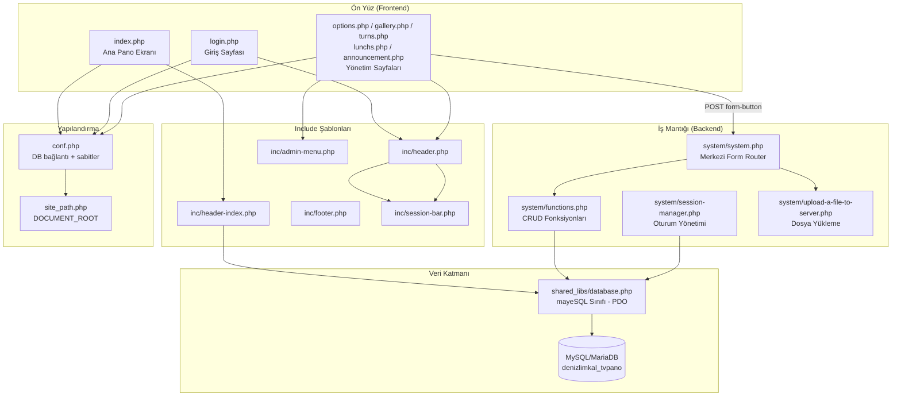
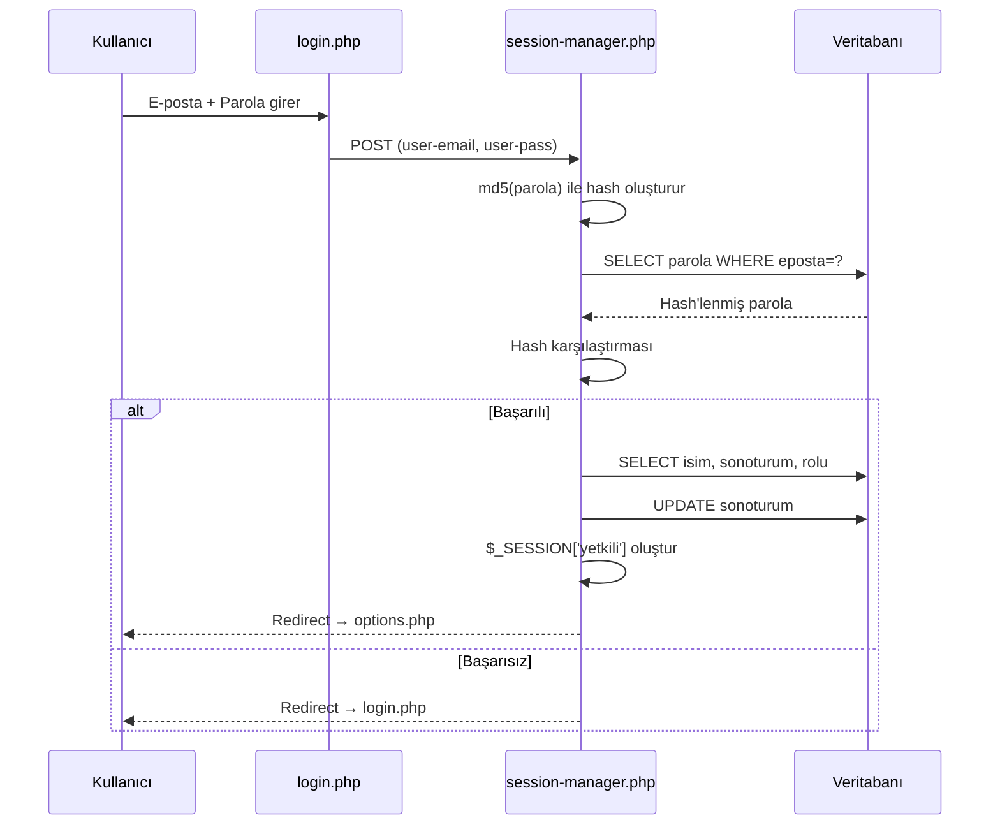
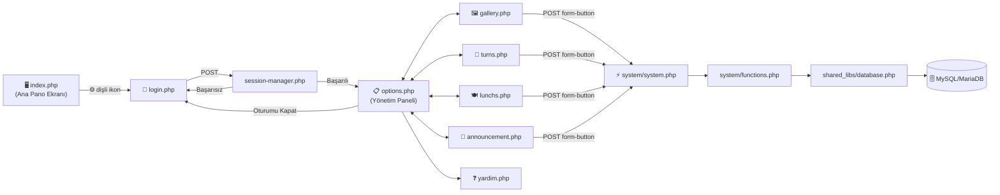

# TV PANO 1.0 (MKAL) — Proje Altyapı ve Dizin Yapısı Dokümantasyonu

> **Proje Adı:** TV PANO v1.1  
> **Geliştirici:** Fatih Anıl ([fatihanil.net.tr](http://www.fatihanil.net.tr))  
> **Telif:** © 2017 – 2026  
> **Hedef Çözünürlük:** 1024×768 piksel (TV / bilgisayar ekranı)  
> **Canlı URL:** `http://denizlimkal.k12.tr/`  
> **Yerel URL:** `http://localhost/panotv_mkal/index.php`

---

## 1. Genel Bakış

TV Pano, bir okul ortamında TV veya bilgisayar ekranlarında sürekli yayın yapacak şekilde tasarlanmış, PHP tabanlı bir dijital pano (signage) uygulamasıdır. Ana sayfada kurum logosu, sınav takvimi, fotoğraf slayt gösterisi, YouTube videosu, nöbet listesi ve kayan yazı duyuru bandı yer alır. Yönetim paneli ile tüm içerik dinamik olarak veritabanından yönetilir.

---

## 2. Teknoloji Yığını (Tech Stack)

| Katman | Teknoloji | Sürüm / Detay |
|---|---|---|
| **Sunucu** | Apache | 2.4.65 (WampServer üzerinde) |
| **Sunucu Dili** | PHP | 8.x |
| **Veritabanı** | MySQL / MariaDB | MySQL 5.6.51 veya MariaDB 10.6.23 |
| **Veritabanı Erişimi** | PDO (PHP Data Objects) | mysql driver |
| **Ön Yüz Framework** | Bootstrap | 3.x (lokal dosya) |
| **JavaScript** | jQuery | 1.11.3 (lokal dosya) |
| **İkon Kütüphanesi** | Font Awesome | 4.7.0 (CDN) |
| **Font** | Google Fonts | Ubuntu, Ubuntu Condensed |
| **Paket Yöneticisi** | Composer | phpoffice/phpspreadsheet ^2.0 |
| **Dosya Yükleme** | PHP `move_uploaded_file()` | — |
| **Oturum Yönetimi** | PHP Session (`$_SESSION`) | — |
| **Şifreleme** | MD5 (`md5()`) | Parola hash'leme |

---

## 3. Proje Dizin Yapısı (Ağaç Görünümü)

```
panotv_mkal/                          ← Proje Kök Dizini
│
├── index.php                         ← Ana sayfa (TV pano ekranı)
├── login.php                         ← Yönetim paneli giriş sayfası
├── options.php                       ← Temel ayarlar (sınavlar, nöbet yerleri, logo, renk)
├── gallery.php                       ← Galeri yönetimi (medya, video)
├── turns.php                         ← Nöbet yönetimi
├── lunchs.php                        ← Yemek menüsü yönetimi
├── announcement.php                  ← Duyuru yönetimi
├── yardim.php                        ← Yardım/kullanım kılavuzu
├── bilgi.php                         ← phpinfo() — sunucu bilgisi
├── conf.php                          ← Merkezi yapılandırma dosyası
├── site_path.php                     ← DOCUMENT_ROOT ayarı
├── .htaccess                         ← Apache yönlendirme kuralı
├── .gitignore                        ← Git dışlama dosyası
├── composer.json                     ← Composer bağımlılıkları
├── composer.lock                     ← Kilitli bağımlılık sürümleri
├── composer.phar                     ← Composer çalıştırılabilir dosyası
├── composer.bat                      ← Composer Windows batch dosyası
├── tvpano_nobetler.csv               ← Nöbet listesi örnek CSV
├── tvpano_nobetler.xls               ← Nöbet listesi örnek Excel
├── error_log                         ← PHP hata günlüğü
│
├── inc/                              ← Include (parçalı şablon) dosyaları
│   ├── header-index.php              ← Ana sayfa HTML head + body açılış
│   ├── header.php                    ← Yönetim sayfaları HTML head + body açılış
│   ├── footer.php                    ← Ortak footer (telif, bağlantılar)
│   ├── admin-menu.php                ← Yönetim paneli sol menü
│   └── session-bar.php               ← Üst oturum bilgi çubuğu
│
├── system/                           ← İş mantığı (backend logic)
│   ├── system.php                    ← Merkezi form işleyici (switch-case router)
│   ├── session-manager.php           ← Oturum açma/kapama işlemleri
│   ├── functions.php                 ← Tüm CRUD fonksiyonları
│   ├── file-upload.php               ← Dosya yükleme fonksiyonu (v1)
│   ├── upload-a-file-to-server.php   ← Dosya yükleme fonksiyonu (v2, aktif)
│   └── error_log                     ← System dizini hata günlüğü
│
├── shared_libs/                      ← Paylaşılan kütüphaneler
│   ├── database.php                  ← mayeSQL sınıfı (PDO wrapper)
│   ├── classes.php                   ← announce sınıfı (taslak, kullanılmıyor)
│   └── shared_libs/                  ← İç içe kopya (database.php, classes.php)
│
├── css/                              ← Stil dosyaları
│   ├── bootstrap.css                 ← Bootstrap 3.x (145 KB)
│   ├── main.css                      ← Ana uygulama stilleri
│   ├── slider.css                    ← Fotoğraf slayt gösterisi stilleri
│   └── video.css                     ← Video iframe stilleri
│
├── js/                               ← JavaScript dosyaları
│   ├── bootstrap.js                  ← Bootstrap 3.x JS
│   ├── jquery-1.11.2.min.js          ← jQuery (eski sürüm)
│   └── jquery-1.11.3.min.js          ← jQuery (aktif kullanılan)
│
├── fonts/                            ← Bootstrap Glyphicons font dosyaları
│   ├── glyphicons-halflings-regular.eot
│   ├── glyphicons-halflings-regular.svg
│   ├── glyphicons-halflings-regular.ttf
│   ├── glyphicons-halflings-regular.woff
│   └── glyphicons-halflings-regular.woff2
│
├── img/                              ← Görseller (logolar, ikonlar)
│   ├── logo-tvpano.png / .svg        ← TV Pano logosu
│   ├── logo-meb.jpg                  ← MEB logosu
│   ├── logom-fatihanil.png / .svg    ← Geliştirici logosu
│   ├── logom-fatihanil-fav.png       ← Favicon
│   ├── Bootstrap.svg                 ← Bootstrap logosu
│   ├── logo-traversi-media.png       ← Traversy Media logosu
│   ├── logo-w3schools.gif / .png     ← W3Schools logosu
│   └── youtube-embed-copy-what.GIF   ← Yardım sayfası ekran görüntüsü
│
├── slider/                           ← Slayt gösterisi içerikleri
│   └── media/                        ← Yüklenen slayt görselleri
│
├── uploads/                          ← Genel dosya yükleme dizini (logo vb.)
│   ├── logo-mkal.png
│   ├── logo-mkal_300x300.png
│   └── logo-tvpano.png
│
├── yuklemeler/                       ← Ek yükleme dizini (boş)
│
├── photo/                            ← Fotoğraf arşivi
│   ├── logo-meb.jpg
│   └── logo-mkal.png
│
├── video/                            ← Video test dosyaları
│   ├── test.html
│   ├── test-youtube.html
│   └── test-eba-video.html
│
├── install/                          ← Kurulum dosyaları
│   ├── index.php                     ← Kurulum giriş sayfası
│   ├── install.php                   ← DB ayarları formu
│   ├── create-db.php                 ← Tabloları oluşturma scripti
│   ├── create-su.php                 ← Süper kullanıcı oluşturma
│   ├── installation-complete.php     ← Kurulum tamamlandı sayfası
│   └── database_creating_scripts.sql ← SQL tablo oluşturma betikleri
│
├── UPLOAD_FROM_CSV/                  ← CSV'den toplu nöbet yükleme
│   ├── tvpano_nobetler_upload_test.csv
│   └── upload_from_csv_nobetler.sql
│
├── vendor/                           ← Composer bağımlılıkları (phpspreadsheet)
├── nbproject/                        ← NetBeans IDE proje dosyaları
├── cgi-bin/                          ← CGI dizini (boş)
└── .vscode/                          ← VS Code ayarları
```

---

## 4. Veritabanı Yapısı

**Veritabanı Adı:** `denizlimkal_tvpano`  
**Tablo Ön Eki:** `tvpano_`  
**Karakter Seti:** `utf8` / `utf8_turkish_ci`  
**Motor:** InnoDB

### 4.1 Tablo Listesi

| # | Tablo Adı | Sabit Adı | Açıklama |
|---|---|---|---|
| 1 | `tvpano_yetkilileri` | `ADMIN_DB_TABLE` | Yönetici kullanıcıları |
| 2 | `tvpano_data` | `APP_DATA_DB_TABLE` | Uygulama ayarları (key-value store) |
| 3 | `tvpano_duyurular` | `DUYURULAR_DB_TABLE` | Kayan yazı duyuruları |
| 4 | `tvpano_nobetler` | `NOBETLER_DB_TABLE` | Günlük nöbet listeleri |
| 5 | `tvpano_yemekler` | `YEMEKLER_DB_TABLE` | Günlük yemek menüsü |
| 6 | `tvpano_slider` | `SLIDER_DB_TABLE` | Slayt gösterisi medyaları |
| 7 | `tvpano_ulusalsinavlar` | `ULUSALSINAVLAR_DB_TABLE` | Sınav takvimi |

### 4.2 Tablo Şemaları

#### `tvpano_yetkilileri` — Yönetici Kullanıcılar
| Kolon | Tip | Açıklama |
|---|---|---|
| `id` | INT(10) UNSIGNED, PK, AI | Birincil anahtar |
| `isim` | VARCHAR(100) | Yönetici adı |
| `parola` | VARCHAR(200) | MD5 ile hashlenmiş parola |
| `sonoturum` | DATETIME | Son oturum açma zamanı |
| `eposta` | VARCHAR(200) | E-posta adresi (kullanıcı adı) |
| `rolu` | VARCHAR(2) | Kullanıcı rolü |

#### `tvpano_data` — Uygulama Ayarları (Key-Value)
| Kolon | Tip | Açıklama |
|---|---|---|
| `id` | INT(11), PK, AI | Birincil anahtar |
| `dataname` | VARCHAR(255) | Ayar adı (logo, video, nobet yeri, slidertime, renk vb.) |
| `dataproperty` | VARCHAR(255) | Ayar tipi/özelliği (color, varchar, url vb.) |
| `datavalue` | VARCHAR(255) | Ayar değeri |

#### `tvpano_duyurular` — Duyurular
| Kolon | Tip | Açıklama |
|---|---|---|
| `id` | INT(11), PK, AI | Birincil anahtar |
| `duyurumetni` | VARCHAR(255) | Duyuru metni |
| `duyurusonu` | DATE | Yayından kalma tarihi |

#### `tvpano_nobetler` — Nöbet Çizelgesi
| Kolon | Tip | Açıklama |
|---|---|---|
| `id` | INT(11), PK, AI | Birincil anahtar |
| `nobetyeri` | VARCHAR(255) | Nöbet yeri adı |
| `nobetci` | VARCHAR(255) | Nöbetçi öğretmen adı |
| `nobetgunu` | VARCHAR(9) | Gün adı (pazartesi, sali, carsamba, persembe, cuma) |

#### `tvpano_yemekler` — Yemek Menüsü
| Kolon | Tip | Açıklama |
|---|---|---|
| `id` | INT(10) UNSIGNED, PK, AI | Birincil anahtar |
| `tarih` | DATE | Yemek tarihi |
| `yemek1` – `yemek4` | VARCHAR(200) | 4 çeşit yemek adı |

#### `tvpano_slider` — Slayt Gösterisi Medyaları
| Kolon | Tip | Açıklama |
|---|---|---|
| `id` | INT(11), PK, AI | Birincil anahtar |
| `itemname` | TEXT | Dosya adı |
| `itempath` | TEXT | Dosya yolu (slider/media/) |
| `itemtext` | TEXT | Açıklama metni |
| `itemheader` | TEXT | Başlık metni |
| `itemexpired` | DATE | Yayın bitiş tarihi |

#### `tvpano_ulusalsinavlar` — Sınav Takvimi
| Kolon | Tip | Açıklama |
|---|---|---|
| `id` | TINYINT(3) UNSIGNED, PK, AI | Birincil anahtar |
| `sinavadi` | VARCHAR(255) | Sınav adı |
| `sinavtarihi` | DATE | Sınav tarihi |

---

## 5. Mimari Yapı

### 5.1 Genel Mimari

Uygulama **prosedürel PHP** mimarisi ile geliştirilmiştir. MVC değildir; ancak kendine özgü bir katmanlı yapı kullanır:



### 5.2 Request Akışı (Form İşleme)

Tüm yönetim paneli formları tek bir merkezi router olan [system.php](file:///d:/servers/public_html/panotv_mkal/system/system.php) üzerinden işlenir:

1. Kullanıcı bir yönetim sayfasında form doldurur
2. Form `action="system/system.php"` ve `method="post"` ile gönderilir
3. `system.php` dosyasında `$_POST['form-button']` değerine göre `switch-case` ile ilgili fonksiyon çağrılır
4. [functions.php](file:///d:/servers/public_html/panotv_mkal/system/functions.php) içindeki fonksiyon çalıştırılır
5. Fonksiyon `mayeSQL` sınıfı ile veritabanı işlemini yapar
6. Başarılı olursa `header("Location:...")` ile kaynak sayfaya yönlendirilir

### 5.3 Oturum Yönetimi Akışı



### 5.4 Oturum Koruma Mekanizması

Tüm yönetim sayfaları aynı kalıbı kullanır:
```php
session_start();
include_once("conf.php");
if (isset($_SESSION['yetkili'])) {
    // Sayfa içeriği
} else {
    header("Location: login.php");
}
```

---

## 6. Dosya Detayları

### 6.1 Yapılandırma Dosyaları

| Dosya | Açıklama |
|---|---|
| [conf.php](file:///d:/servers/public_html/panotv_mkal/conf.php) | MySQL bağlantı bilgileri, tablo sabit tanımları, URL/dizin sabitleri, uygulama başlığı |
| [site_path.php](file:///d:/servers/public_html/panotv_mkal/site_path.php) | `$_SERVER['DOCUMENT_ROOT']` değerini proje kök dizinine ayarlar |
| [.htaccess](file:///d:/servers/public_html/panotv_mkal/.htaccess) | `/mkal` → `http://denizlimkal.k12.tr` 301 yönlendirmesi |

### 6.2 Ana Sayfa Bileşenleri ([index.php](file:///d:/servers/public_html/panotv_mkal/index.php))

| Bölüm | Kolon | Açıklama |
|---|---|---|
| Kurum Logosu | Sol (col-md-2) | `tvpano_data` tablosundan dinamik logo |
| Sınav Takvimi | Sol (col-md-2) | Geri sayım ile sınava kalan süre |
| Fotoğraf Slider | Orta (col-md-7) | JS ile otomatik geçişli slayt gösterisi |
| YouTube Video | Orta (col-md-7) | YouTube IFrame API ile otomatik oynatma |
| Tarih ve Nöbet | Sağ (col-md-3) | Günlük nöbet listesi tablosu |
| Duyuru Bandı | Alt (col-md-12) | CSS marquee animasyonlu kayan yazı |
| Giriş İkonu | Sağ alt köşe | Dönen dişli çark (login.php'ye bağlantı) |

> **Not:** Ana sayfa 900 saniyede (15 dakika) bir otomatik yenilenir (`<meta http-equiv="Refresh" content="900">`).

### 6.3 Yönetim Paneli Sayfaları

| Sayfa | İşlev | Form Butonları |
|---|---|---|
| [login.php](file:///d:/servers/public_html/panotv_mkal/login.php) | Giriş + Menü (çift görünüm) | OTURUMU AÇ |
| [options.php](file:///d:/servers/public_html/panotv_mkal/options.php) | Sınav, nöbet yeri, logo, renk, slider süresi | SINAV EKLE/SİL/GÜNCELLE, NÖBET YERİ EKLE/SİL/GÜNCELLE, LOGOYU GÜNCELLE, RENKLERİ DEĞİŞTİR, SLIDER SÜRESİNİ KAYDET |
| [gallery.php](file:///d:/servers/public_html/panotv_mkal/gallery.php) | Medya yönetimi + Video | YAYINI SİL, YENİYİ YAYINLA, VİDEOYU GÜNCELLE |
| [turns.php](file:///d:/servers/public_html/panotv_mkal/turns.php) | Nöbet çizelgesi | EXCEL'İ YÜKLE, NÖBETÇİLERİ GÖSTER/KAYDET/TEMİZLE |
| [lunchs.php](file:///d:/servers/public_html/panotv_mkal/lunchs.php) | Yemek menüsü | YEMEKLERİ KAYDET |
| [announcement.php](file:///d:/servers/public_html/panotv_mkal/announcement.php) | Duyuru CRUD | DUYURU EKLE, DUYURUYU SİL/GÜNCELLE |
| [yardim.php](file:///d:/servers/public_html/panotv_mkal/yardim.php) | Kullanım kılavuzu | — (salt okunur) |

### 6.4 Backend Fonksiyonları ([functions.php](file:///d:/servers/public_html/panotv_mkal/system/functions.php))

| Fonksiyon | İşlev |
|---|---|
| `sinavEkle()` | Yeni sınav kaydı ekler |
| `sinaviSil()` | Sınav kaydını siler |
| `sinaviGuncelle()` | Sınav bilgilerini günceller |
| `nobetSayisiniGuncelle()` | Nöbet sayısını günceller |
| `logoyuGuncelle()` | Kurum logosunu günceller (INSERT veya UPDATE) |
| `renkleriDegistir()` | Renk ayarlarını günceller |
| `duyuruEkle()` | Boş duyuru kaydı ekler |
| `duyuruyuSil()` | Duyuruyu siler |
| `duyuruyuGuncelle()` | Duyuru metnini günceller |
| `yemekleriKaydet()` | Yemek menüsünü kaydeder (INSERT veya UPDATE) |
| `nobetYeriEkle()` | Yeni nöbet yeri ekler |
| `nobetYeriniSil()` | Nöbet yerini siler |
| `nobetiYeriniGuncelle()` | Nöbet yeri adını günceller |
| `nobetcileri_kaydet()` | Nöbetçi listesini kaydeder (toplu INSERT) |
| `nobetcileriTemizle()` | Nöbet tablosunu TRUNCATE eder |
| `medyayiSil()` | Slider medyasını DB ve dosya sisteminden siler |
| `yeniMedyaEkle()` | Yeni slider medyası yükler ve DB'ye kaydeder |
| `excelden_nobet_yukle()` | Excel dosyasından nöbet listesi toplu yükler (PhpSpreadsheet) |
| `sliderSuresiniGuncelle()` | Slider geçiş süresini günceller |
| `videoyuGuncelle()` | YouTube video ID'sini günceller |

### 6.5 Veritabanı Sınıfı — `mayeSQL` ([database.php](file:///d:/servers/public_html/panotv_mkal/shared_libs/database.php))

```php
class mayeSQL {
    public $db;                    // PDO bağlantı nesnesi
    __construct()                  // PDO ile MySQL'e bağlanır
    sentQuery($sql)                // SELECT → query() + FETCH_ASSOC
                                   // INSERT/UPDATE/DELETE → exec()
    __destruct()                   // Bağlantıyı kapatır ($db = null)
}
```

**Sorgu Mantığı:**
- SQL cümlesi `SELECT` ile başlıyorsa → `PDO::query()` ile çalıştırılır, sonuçlar ilişkisel dizi olarak döner
- Diğer sorgular (INSERT, UPDATE, DELETE) → `PDO::exec()` ile çalıştırılır

---

## 7. Ön Yüz Yapısı

### 7.1 CSS Dosyaları

| Dosya | İçerik |
|---|---|
| [bootstrap.css](file:///d:/servers/public_html/panotv_mkal/css/bootstrap.css) | Bootstrap 3.x framework stili (145 KB) |
| [main.css](file:///d:/servers/public_html/panotv_mkal/css/main.css) | Marquee animasyonu, body stil, nöbet tablosu, duyuru bandı, login, yönetim formları, galeri thumbnail'leri |
| [slider.css](file:///d:/servers/public_html/panotv_mkal/css/slider.css) | Fotoğraf slayt gösterisi stilleri (contain, center, siyah arka plan) |
| [video.css](file:///d:/servers/public_html/panotv_mkal/css/video.css) | YouTube iframe boyutlandırma (30vh) |

### 7.2 JavaScript (index.php inline)

| Özellik | Mekanizma |
|---|---|
| **Slayt Gösterisi** | `autoChangeSlide()` — `setTimeout()` ile 5 saniyelik otomatik döngü |
| **YouTube Video** | YouTube IFrame API — Otomatik oynatma, bitince tekrar başlama |

### 7.3 Duyuru Bandı

CSS `@keyframes marquee` animasyonu ile sağdan sola kayan yazı. `flex` ve `translateX(-50%)` kullanılarak sonsuz döngü sağlanır. `prefers-reduced-motion` medya sorgusu ile erişilebilirlik desteği vardır.

---

## 8. Dosya Yükleme Mekanizması

İki ayrı dosya yükleme fonksiyonu bulunur:

| Fonksiyon | Dosya | Kullanım Alanı |
|---|---|---|
| `dosyayiSunucuyaYukle()` | [file-upload.php](file:///d:/servers/public_html/panotv_mkal/system/file-upload.php) | Logo yükleme (`uploads/` dizini) |
| `sunucuyaDosyaKaydet()` | [upload-a-file-to-server.php](file:///d:/servers/public_html/panotv_mkal/system/upload-a-file-to-server.php) | Slider medyası yükleme (`slider/media/` dizini) |

**`sunucuyaDosyaKaydet()` Dosya Adlandırma:** `tvpano` + tarih + saat + uzantı  
Örnek: `tvpano20240301-143022.jpg`

**Kontroller:**
- Dosya bozukluk kontrolü (`$_FILES['error']`)
- Uzantı kontrolü (izin verilen tiplere göre)
- Boyut sınırı kontrolü
- `move_uploaded_file()` ile hedef dizine taşıma

---

## 9. Kurulum Sistemi

[install/](file:///d:/servers/public_html/panotv_mkal/install) dizini altında:

1. **index.php** — Kurulum giriş sayfası
2. **install.php** — Veritabanı bağlantı bilgilerini girmek için form
3. **create-db.php** — 7 tabloyu sırasıyla oluşturur (DROP → CREATE zincirleme)
4. **create-su.php** — İlk süper kullanıcıyı oluşturur
5. **installation-complete.php** — Kurulum tamamlandı bildirimi
6. **database_creating_scripts.sql** — Bağımsız SQL tablo oluşturma betikleri

---

## 10. Yapılandırma Sabitleri ([conf.php](file:///d:/servers/public_html/panotv_mkal/conf.php))

### Veritabanı Sabitleri
| Sabit | Değer |
|---|---|
| `MYSQL_HOST` | `localhost` |
| `MYSQL_USER` | `denizlimkal_tvpa` |
| `MYSQL_PASS` | *(tanımlı)* |
| `MYSQL_DATABASE` | `denizlimkal_tvpano` |
| `DB_PREFIX` | `tvpano_` |

### URL / Dizin Sabitleri
| Sabit | Açıklama |
|---|---|
| `SITE_URL` | Dinamik: localhost ise `http://localhost/panotv_mkal/`, aksi halde `http://denizlimkal.k12.tr/` |
| `SITE_REAL_PATH` | `$_SERVER['DOCUMENT_ROOT']` |
| `SHARED_LIBS` | `DOCUMENT_ROOT/shared_libs/` |
| `APP_IMAGE_DIR` | `img/` |
| `FILE_UPLOAD_DIR` | `/uploads/` |
| `SLIDER_MEDIA_PATH` | `slider/media/` |
| `SITE_CSS_DIR` | `SITE_URL/css/` |

### Uygulama Sabitleri
| Sabit | Değer |
|---|---|
| `APP_TITLE` | `TV PANO 1.0` |
| `MANAGEMENT_LOGO` | `SITE_URL/img/logo-tvpano.png` |

---

## 11. Harici Bağımlılıklar

| Bağımlılık | Kaynak | Amaç |
|---|---|---|
| Bootstrap 3.x | Lokal dosya | CSS framework + UI bileşenleri |
| jQuery 1.11.3 | Lokal dosya | Bootstrap JS bağımlılığı |
| Font Awesome 4.7.0 | CDN (cdnjs) | İkon seti |
| Google Fonts (Ubuntu) | CDN (Google) | Tipografi |
| YouTube IFrame API | CDN (YouTube) | Video oynatıcı |
| phpoffice/phpspreadsheet ^2.0 | Composer | Excel dosyası okuma (nöbet yükleme) |
| Glyphicons Halflings | Lokal font dosyaları | Bootstrap ikon fontu |

---

## 12. Oturum Verileri (`$_SESSION`)

```php
$_SESSION['yetkili'] = [
    'rolu'      => string,  // Kullanıcı rolü (2 karakter)
    'ismi'      => string,  // Yetkili adı
    'eposta'    => string,  // E-posta adresi
    'sonoturum' => string   // Son oturum açma zamanı
];
```

---

## 13. Sayfa Akış Diyagramı



---

> [!NOTE]
> Bu dokümantasyon, projenin tüm kaynak kodlarının analizi sonucu oluşturulmuştur. Proje, 2017'den 2026'ya kadar süregelen geliştirilmiş bir okul dijital pano uygulamasıdır.
